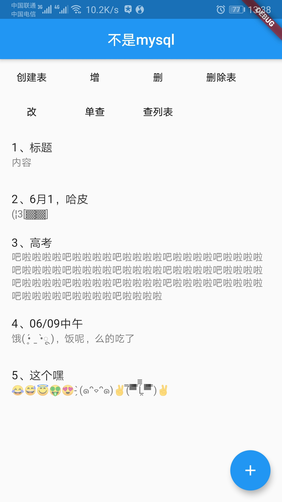
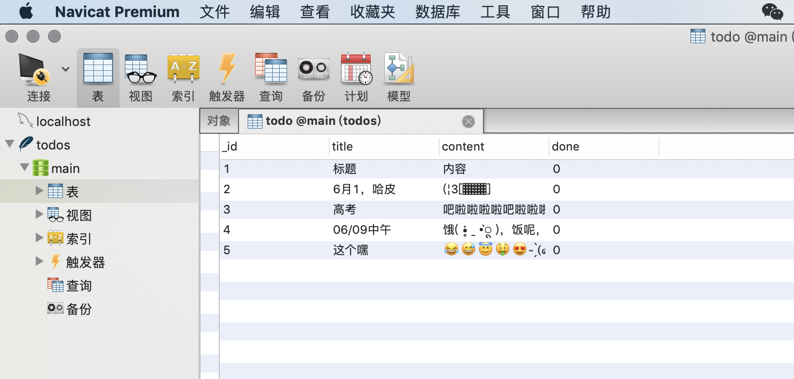
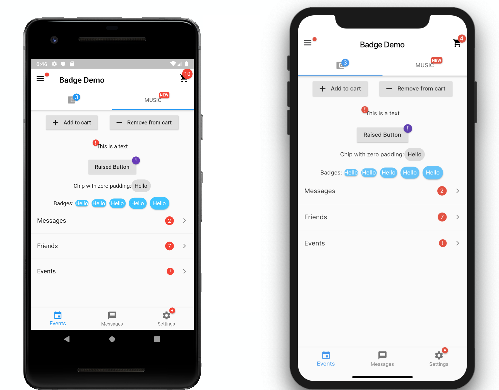
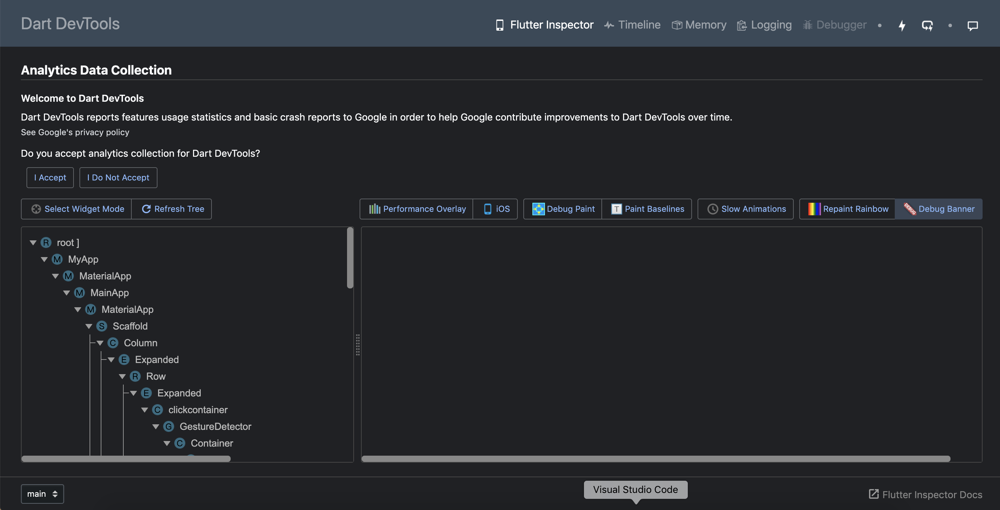

# flutter 应用内部升级
# 项目参考
[app-update](https://github.com/hehuapei/flutter-demo/tree/master/app_update_demo)
[app-update fork](https://github.com/841660202/flutter-demo)

 ## 插件

<!-- 图标 -->
  cupertino_icons: ^0.1.2

  permission_handler: ^3.0.1

  [# permission_handler](https://pub.dartlang.org/packages/permission_handler#-installing-tab-)


  flutter_downloader: ^1.1.3

  [# flutter_downloader ](https://pub.dartlang.org/packages/flutter_downloader)

  install_plugin: ^2.0.0

  [# install_plugin](https://pub.dartlang.org/packages/install_plugin)


  package_info: ^0.4.0+3]

  [# package_info](https://pub.dev/packages/package_info)


  path_provider: ^0.4.0

  [# path_provider](https://pub.dev/packages/path_provider)

  ## sqlite
  ### 原有表，后来表结构发生改动怎么办？
  原来表没有content字段，后来添加该字段，如果要先查询，数据库没有该字段，会出异常
  ### 如何查看db数据，如果以后用户说出问题了，可以把db上传，查看



## Text
[Text解读](https://www.jianshu.com/p/4bbda37daabf)
[Container解读](https://www.jianshu.com/p/383b772049c0)
[TextField解读](https://www.jianshu.com/p/5d44d26d3556)
[listTile解读](https://www.jianshu.com/p/c80c2b70ee09)
## swiper
[定制化demo](https://blog.csdn.net/ddwhan0123/article/details/89470221)


4.2 App生命周期
需要指出的是如果想要知道App的生命周期,那么需要通过WidgetsBindingObserver的didChangeAppLifecycleState 来获取。通过该接口可以获取是生命周期在AppLifecycleState类中。常用状态包含如下几个：


名称
状态


resumed
可见并能相应用户的输入


inactive
处在并不活动状态，无法处理用户相应


paused
不可见并不能相应用户的输入，但是在后台继续活动中


一个实际场景中的例子：
在不考虑suspending的情况下：从后台切入前台生命周期变化如下:

AppLifecycleState.inactive->AppLifecycleState.resumed;

从前台压后台生命周期变化如下：

AppLifecycleState.inactive->AppLifecycleState.paused;


3. Visibility
当你看完Flutter Widge文档的时候，我们突然发现一个略显尴尬的问题：组件是否显示怎么控制？貌似所有的组件中都没有这个属性！这不坑了，咋办？
目前看方法无非如下几个：
3.1 删除法
核心将该真实widget或者widget树从renderTree中移除。
具体到实践级别主要分为两个：

单个组件‘隐藏’自己。在build方法中返回一个空的Container.

@override
Widget build(BuildContext context) {
  return isVisible
      ? Widget //真的Widget
      : new Container(); //空Widget 仅仅占位 并不显示
}


多个child

在父容器的children字段的list中，删除掉对应的cell。
3.2 Offstage
Offstage 是一个widget。Offstage的offstage属性设置为true，那么Offstage以及他的child都将不会被绘制到界面上。
sample code如下：
@override
Widget build(BuildContext context) {
  return new Offstage(
          offstage: !isVisible,
          child:child);
}

3.3 透明度
设置widget的透明度，使之不可见。但是这样的方法是副作用的。因为这个对应的widget树是已经经过了完整的layout&paint过程，成本高。同时设置透明度本身也要耗费一定的计算资源，造成了二次浪费。需要注意的是即便变透明了，占据的位置还在。大家慎重选择使用。
sample code如下：
@override
Widget build(BuildContext context) {
  return new AnimatedOpacity(
        duration: Duration(milliseconds: 10),
        opacity: isVisible ? 1.0 : 0.0,
          child:child);
}

visibility的控制还是比较麻烦的。这是Flutter设计上不符合正常习惯的一个点，需要大家重点关注。

## 视觉差
[视觉差](https://www.jianshu.com/p/e6dafb114855)
## badge
[badge](https://dartlang-pub.appspot.com/packages/badges)



[介绍页](https://dartlang-pub.appspot.com/packages/intro_slider)


## 签名

```
keytool -genkey -alias **** -keyalg RSA -validity 100000 -keystore ****.jks
```

## 推送
华为push需要 SHA256证书指纹，需要用到

```
keytool -list  -v -keystore ****.jks -storepass 密码
```

## 配置签名
1、local.properties 同级添加key.properties

```
storePassword=密码
keyPassword=密码
keyAlias=key
storeFile=/Users/chenhailong/development/my_flutter/key.jks
```

2、open android/app/build.gradle

```
// 发布签名
def keystorePropertiesFile = rootProject.file("key.properties")
def keystoreProperties = new Properties()
keystoreProperties.load(new FileInputStream(keystorePropertiesFile))
defaultConfig {
    // TODO: Specify your own unique Application ID (https://developer.android.com/studio/build/application-id.html).
    applicationId "com.example.update_in_app"
    minSdkVersion 16
    targetSdkVersion 28
    versionCode flutterVersionCode.toInteger()
    versionName flutterVersionName
    testInstrumentationRunner "android.support.test.runner.AndroidJUnitRunner"
}
// 新增签名配置
signingConfigs {
    release {
        keyAlias keystoreProperties['keyAlias']
        keyPassword keystoreProperties['keyPassword']
        storeFile file(keystoreProperties['storeFile'])
        storePassword keystoreProperties['storePassword']
    }
}
// 修改签名配置
buildTypes {
    release {
        // TODO: Add your own signing config for the release build.
        // Signing with the debug keys for now, so `flutter run --release` works.
        // signingConfig signingConfigs.debug
        signingConfig signingConfigs.release
    }
}
```

## 打包
flutter build

## Dart DevTools
[ Dart DevTools](https://flutter.github.io/devtools/vscode)



## 对话框

[Flutter - 自定义Dialog](https://www.jianshu.com/p/4bbbb5aa855d)
