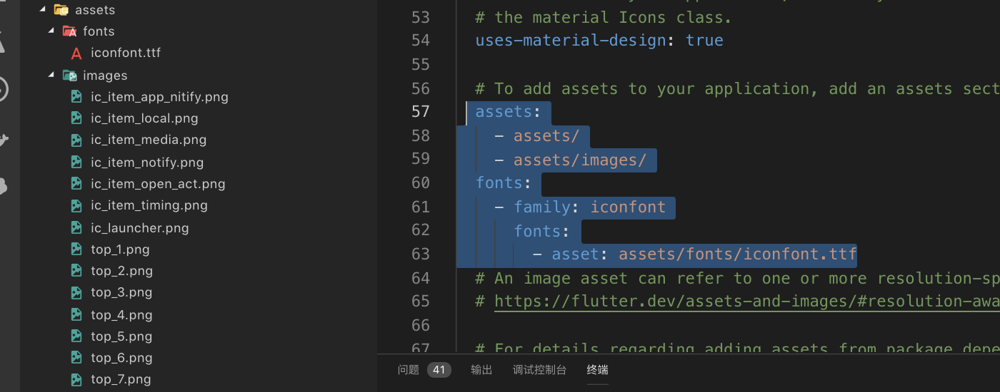
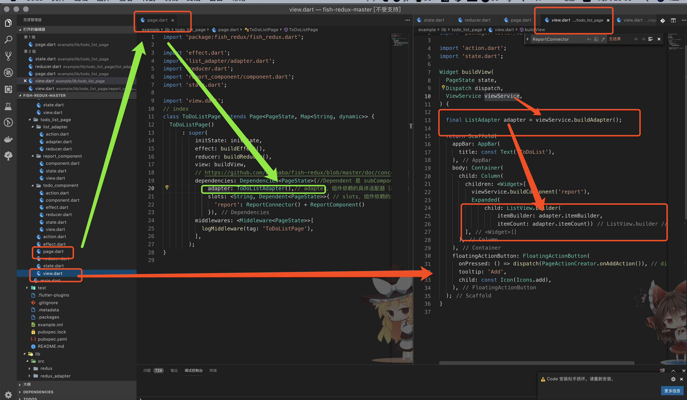
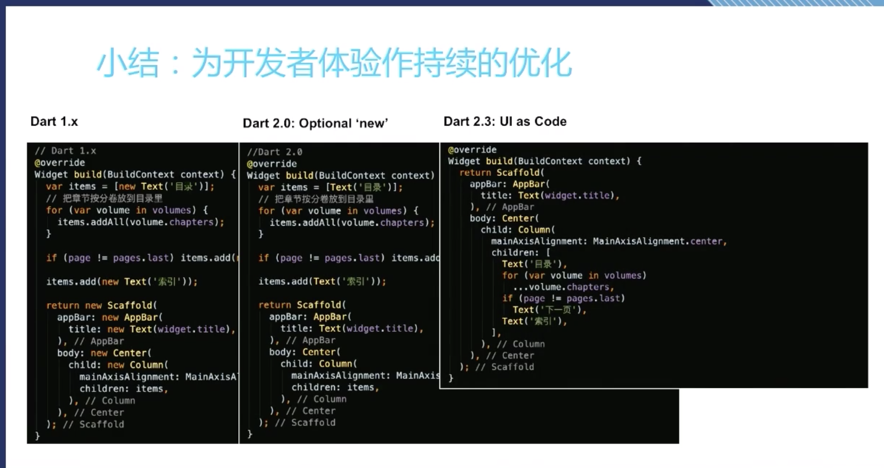
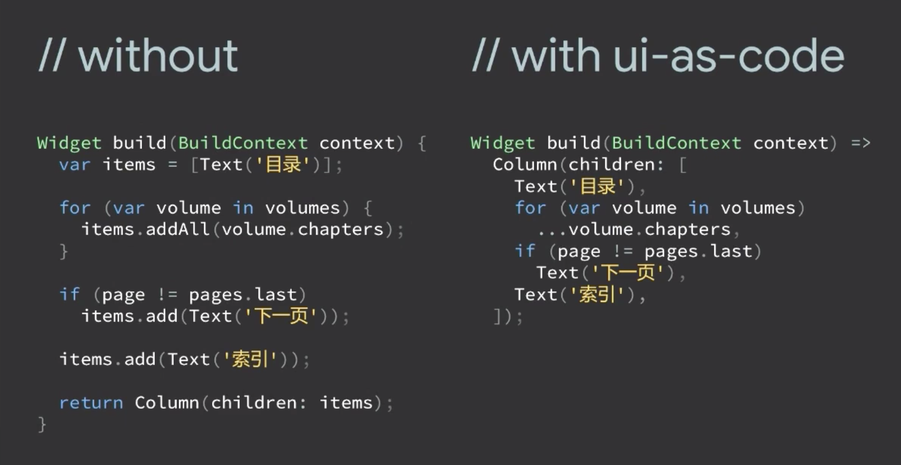
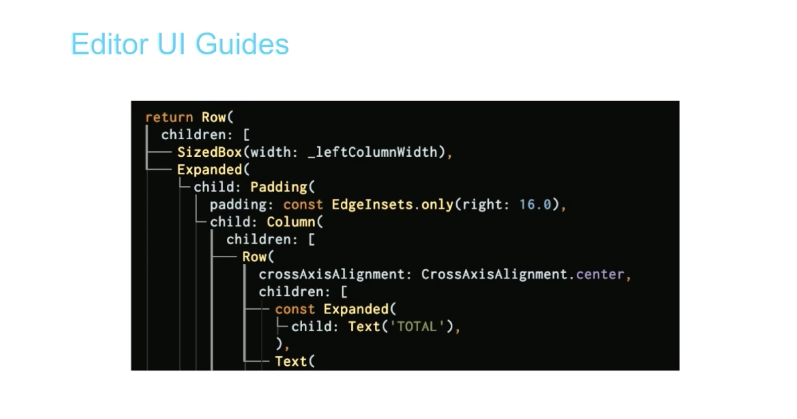
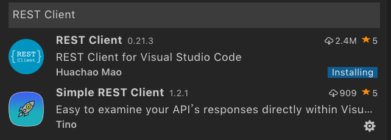

[flutter-go](https://github.com/alibaba/flutter-go)

[Flutter-Notebook](https://github.com/OpenFlutter/Flutter-Notebook)

[FlutterDouBan](https://github.com/kaina404/FlutterDouBan)

[fish-redux](https://github.com/alibaba/fish-redux)


## yaml
* 本地资源图片
```yaml
assets:
    - assets/
    - assets/images/
```
* 本地字体文件
```yaml
fonts:
    - family: iconfont
        fonts:
        - asset: assets/fonts/iconfont.ttf

```
 
 
## Awesome Flutter Snippets

| Shortcut        | Expanded                 | Description                                                                                                                                                                         |
| :-------------- | :----------------------- | :---------------------------------------------------------------------------------------------------------------------------------------------------------------------------------- |
| statelessW      | Stateless Widget         | Creates a Stateless widget                                                                                                                                                          |
| statefulW       | Stateful Widget          | Creates a Stateful widget                                                                                                                                                           |
| build           | Build Method             | Describes the part of the user interface represented by the widget.                                                                                                                 |
| initS           | InitState                | Called when this object is inserted into the tree. The framework will call this method exactly once for each State object it creates.                                               |
| dis             | Dispose                  | Called when this object is removed from the tree permanently. The framework calls this method when this State object will never build again.                                        |
| reassemble      | Reassemble               | Called whenever the application is reassembled during debugging, for example during hot reload.                                                                                     |
| didChangeD      | didChangeDependencies    | Called when a dependency of this State object changes                                                                                                                               |
| didUpdateW      | didUpdateWidget          | Called whenever the widget configuration changes.                                                                                                                                   |
| customClipper   | Custom Clipper           | Used for creating custom shapes                                                                                                                                                     |
| customPainter   | Custom Painter           | Used for creating custom paint                                                                                                                                                      |
| listViewB       | ListView.Builder         | Creates a scrollable, linear array of widgets that are created on demand.Providing a non-null itemCount improves the ability of the ListView to estimate the maximum scroll extent. |
| customScrollV   | Custom ScrollView        | Creates a ScrollView that creates custom scroll effects using slivers. If the primary argument is true, the controller must be null.                                                |
| streamBldr      | Stream Builder           | Creates a new StreamBuilder that builds itself based on the latest snapshot of interaction with the specified stream                                                                |
| animatedBldr    | Animated Builder         | Creates an Animated Builder. The widget specified to child is passed to the builder                                                                                                 |
| statefulBldr    | Stateful Builder         | Creates a widget that both has state and delegates its build to a callback. Useful for rebuilding specific sections of the widget tree.                                             |
| oriantationBldr | Orientation Builder      | Creates a builder which allows for the orientation of the device to be specified and referenced                                                                                     |
| layoutBldr      | Layout Builder           | Similar to the Builder widget except that the framework calls the builder function at layout time and provides the parent widget's constraints.                                     |
| singleChildSV   | Single Child Scroll View | Creates a scroll view with a single child                                                                                                                                           |
| futureBldr      | Future Builder           | Creates a Future Builder. This builds itself based on the latest snapshot of interaction with a Future.                                                                             |
| nosm            | No Such Method           | This method is invoked when a non-existent method or property is accessed.                                                                                                          |
| inheritedW      | Inherited Widget         | Class used to propagate information down the widget tree.                                                                                                                           |
| mounted         | Mounted                  | Whether this State object is currently in a tree.                                                                                                                                   |
| snk             | Sink                     | A Sink is the input of a stream.                                                                                                                                                    |
| strm            | Stream                   | A source of asynchronous data events. A stream can be of any data type.                                                                                                             |
| toStr           | To String                | Returns a string representation of this object.                                                                                                                                     |
| debugP          | Debug Print              | Prints a message to the console, which you can access using the flutter tool's logs command (flutter logs).                                                                         |
| importM         | Material Package         | Import Material package.                                                                                                                                                            |
| importC         | Cupertino Package        | Import Cupertino package.                                                                                                                                                           |
| mateapp         | Material App             | Create a new Material App.                                                                                                                                                          |
| cupeapp         | Cupertino Package        | Create a New Cupertino App.                                                                                                                                                         |


## 封装请求 v1
```dart
import 'package:flutter/material.dart';
import 'package:fluttertoast/fluttertoast.dart';

class Tip {
  static success(message) {
    Fluttertoast.showToast(
      msg: message,
      backgroundColor: Colors.black54,
      toastLength: Toast.LENGTH_SHORT,
      gravity: ToastGravity.CENTER,
      timeInSecForIos: 1,
    );
  }
  static fail(message) {
    Fluttertoast.showToast(
      msg: message,
      backgroundColor: Colors.red[400],
      toastLength: Toast.LENGTH_SHORT,
      gravity: ToastGravity.CENTER,
      timeInSecForIos: 1,
    );
  }
}


```

```dart

// 版本1,
// 缺陷，因为dio拦截器是在实例化之外，request之中，这就导致每次请求的时候都会对dio添加拦截器，而dio的拦截器并不是覆盖上一个拦截器，会导致拦截器重叠，最终结果是：第一次请求，执行一次拦截（返回一次），第二次请求，执行两次拦截（返回2次），第三次请求会执行三次拦截（返回3次）
import 'dart:convert';

import 'package:dio/dio.dart';
import 'package:flutter/material.dart';
import 'dart:io';
import 'dart:async';
import 'package:fluttertoast/fluttertoast.dart';

import 'toast.dart';
/*
 * 封装 restful 请求
 *
 * GET、POST、DELETE、PATCH
 * 主要作用为统一处理相关事务：
 *  - 统一处理请求前缀；
 *  - 统一打印请求信息；
 *  - 统一打印响应信息；
 *  - 统一打印报错信息；
 */

class HttpUtils {
  /// global dio object
  static Dio dio;

  /// default options
  static const String API_PREFIX =
      'https://www.easy-mock.com/mock/5d131430724519274de77822/am';
  static const int CONNECT_TIMEOUT = 10000;
  static const int RECEIVE_TIMEOUT = 3000;

  /// http request methods
  static const String GET = 'get';
  static const String POST = 'post';
  static const String PUT = 'put';
  static const String PATCH = 'patch';
  static const String DELETE = 'delete';

  static Future<dynamic> request(String url, {data, method}) async {
    data = data ?? {};
    method = method ?? 'GET';

    /// restful 请求处理
    data.forEach((key, value) {
      if (url.indexOf(key) != -1) {
        url = url.replaceAll(':$key', value.toString());
      }
    });

    Dio dio = createInstance();

//添加拦截器
    dio.interceptors
        .add(InterceptorsWrapper(onRequest: (RequestOptions options) {
      print("请求之前");
      return options; //continue
    }, onResponse: (Response response) {
      print("响应之前");
      // solveServiceCode(response);
      return response; // continue
    }, onError: (DioError e) {
      print("错误之前");
      formatExceptionError(e);
      return null;
    }));

    /// 打印请求相关信息：请求地址、请求方式、请求参数
    print('请求地址：【' + dio.options.baseUrl + url + '】');
    print('请求参数：' + data.toString());

    var result;

    try {
      Response response = await dio.request(url,
          data: data, options: new Options(method: method));
      // result = response.data;
      result = await solveServiceCode(response);
      /// 打印响应相关信息
      print('响应数据成功！');
    } on DioError catch (e) {
      print('请求出错：' + e.toString());
    }
    print("result>>>>>>>>" + result.toString());
    return result;
  }

  /// 创建 dio 实例对象
  static Dio createInstance() {
    if (dio == null) {
      /// 全局属性：请求前缀、连接超时时间、响应超时时间
      BaseOptions option = new BaseOptions(
          baseUrl: API_PREFIX,
          connectTimeout: CONNECT_TIMEOUT,
          receiveTimeout: RECEIVE_TIMEOUT,
          headers: {"user-agent": "dio", "api": "1.0.0"},
          contentType: ContentType.JSON,
          // Transform the response data to a String encoded with UTF8.
          // The default value is [ResponseType.JSON].
          responseType: ResponseType.plain);
      dio = new Dio(option);
    }

    return dio;
  }

  /// 清空 dio 对象
  clear() {
    dio = null;
  }

  // 拦截器-响应之前
  static solveServiceCode(Response response) {
    var result = response.data;
    print('result');
    print(result);
    var data = json.decode(result);
    if (data["code"] != '000000') {
      Tip.fail(data["message"] is String ? data["message"] : '未知错误');
      return null;
    }
    return data;
  }

  // 拦截器-错误之前-异常错误处理
  static formatExceptionError(DioError e) {
    String message = '';
    if (e.type == DioErrorType.CONNECT_TIMEOUT) {
      // It occurs when url is opened timeout.
      print("连接超时");
      message = "连接超时";
    } else if (e.type == DioErrorType.SEND_TIMEOUT) {
      // It occurs when url is sent timeout.
      print("请求超时");
    } else if (e.type == DioErrorType.RECEIVE_TIMEOUT) {
      //It occurs when receiving timeout
      print("响应超时");
      message = "响应超时";
    } else if (e.type == DioErrorType.RESPONSE) {
      // When the server response, but with a incorrect status, such as 404, 503...
      print("出现异常");
      message = "出现异常";
    } else if (e.type == DioErrorType.CANCEL) {
      // When the request is cancelled, dio will throw a error with this type.
      print("请求取消");
      message = "请求取消";
    } else {
      //DEFAULT Default error type, Some other Error. In this case, you can read the DioError.error if it is not null.
      print("未知错误");
      message = "未知错误";
    }
    Tip.fail(message);
  }
}
```


```dart
// 版本2,
// file: httpUtil.dart
import 'dart:convert';

import 'package:dio/dio.dart';

import 'dart:io';
import 'dart:async';

import 'tip.dart';
/*
 * 封装 restful 请求
 *
 * GET、POST、DELETE、PATCH
 * 主要作用为统一处理相关事务：
 *  - 统一处理请求前缀；
 *  - 统一打印请求信息；
 *  - 统一打印响应信息；
 *  - 统一打印报错信息；
 */

class HttpUtils {
  /// global dio object
  static Dio dio;

  /// default options
  static const String API_PREFIX =
      'https://www.easy-mock.com/mock/5d131430724519274de77822/am';
  static const int CONNECT_TIMEOUT = 10000;
  static const int RECEIVE_TIMEOUT = 3000;

  /// http request methods
  static const String GET = 'get';
  static const String POST = 'post';
  static const String PUT = 'put';
  static const String PATCH = 'patch';
  static const String DELETE = 'delete';

  static Future<dynamic> request(String url, {data, method}) async {
    print('api :');
    data = data ?? {};
    method = method ?? 'GET';

    /// restful 请求处理
    data.forEach((key, value) {
      if (url.indexOf(key) != -1) {
        url = url.replaceAll(':$key', value.toString());
      }
    });

    Dio dio = createInstance();

    /// 打印请求相关信息：请求地址、请求方式、请求参数
    print('请求地址：【' + dio.options.baseUrl + url + '】');
    print('请求参数：' + data.toString());

    var result;

    try {
      Response response = await dio.request(url,
          data: data, options: new Options(method: method));
      result = response.data;
      print('响应数据成功！');
    } on DioError catch (e) {
      print('请求出错：' + e.toString());
    }
    print(result.toString());
    return result; //不做处理，在拦截器处理
  }

  /// 创建 dio 实例对象
  static Dio createInstance() {
    print('createInstance');
    if (dio == null) {
      /// 全局属性：请求前缀、连接超时时间、响应超时时间
      BaseOptions option = new BaseOptions(
          baseUrl: API_PREFIX,
          connectTimeout: CONNECT_TIMEOUT,
          receiveTimeout: RECEIVE_TIMEOUT,
          headers: {"user-agent": "dio", "api": "1.0.0"},
          contentType: ContentType.JSON,
          // Transform the response data to a String encoded with UTF8.
          // The default value is [ResponseType.JSON].
          responseType: ResponseType.plain);
      dio = new Dio(option);
      //添加拦截器
      dio.interceptors
          .add(InterceptorsWrapper(onRequest: (RequestOptions options) {
        print("请求之前");
        return options; //continue
      }, onResponse: (Response response) {
        print("响应之前");
        // solveServiceCode(response);
        return solveServiceCode(response); // continue
      }, onError: (DioError e) {
        print("错误之前");
        formatExceptionError(e);
        return null;
      }));
    }

    return dio;
  }

  /// 清空 dio 对象
  clear() {
    dio = null;
  }

  // 拦截器-响应之前
  static solveServiceCode(Response response) {
    var result = response.data;
    var data = json.decode(result);
    if (data["code"] != '000000') {
      Tip.fail(data["message"] is String ? data["message"] : '未知错误');
      return null;
    }
    print(data.toString());
    return data['data'];
  }

  // 拦截器-错误之前-异常错误处理
  static formatExceptionError(DioError e) {
    String message = '';
    if (e.type == DioErrorType.CONNECT_TIMEOUT) {
      // It occurs when url is opened timeout.
      print("连接超时");
      message = "连接超时";
    } else if (e.type == DioErrorType.SEND_TIMEOUT) {
      // It occurs when url is sent timeout.
      print("请求超时");
    } else if (e.type == DioErrorType.RECEIVE_TIMEOUT) {
      //It occurs when receiving timeout
      print("响应超时");
      message = "响应超时";
    } else if (e.type == DioErrorType.RESPONSE) {
      // When the server response, but with a incorrect status, such as 404, 503...
      print("出现异常");
      message = "出现异常";
    } else if (e.type == DioErrorType.CANCEL) {
      // When the request is cancelled, dio will throw a error with this type.
      print("请求取消");
      message = "请求取消";
    } else {
      //DEFAULT Default error type, Some other Error. In this case, you can read the DioError.error if it is not null.
      print("未知错误");
      message = "未知错误";
    }
    Tip.fail(message);
  }
}


```

```dart
// file: tip.dart
import 'package:flutter/material.dart';
import 'package:fluttertoast/fluttertoast.dart';

class Tip {
  static success(message) {
    Fluttertoast.showToast(
      msg: message,
      backgroundColor: Colors.black54,
      toastLength: Toast.LENGTH_SHORT,
      gravity: ToastGravity.CENTER,
      timeInSecForIos: 1,
    );
  }
  static fail(message) {
    Fluttertoast.showToast(
      msg: message,
      backgroundColor: Colors.red[400],
      toastLength: Toast.LENGTH_SHORT,
      gravity: ToastGravity.CENTER,
      timeInSecForIos: 1,
    );
  }
}


```

```dart
// api/user.dart
static Future<List<User>> getUser() async {
    var data = await HttpUtils.request(
      '/userDataCode',
      // '/userDataCodeMessage',
      method: HttpUtils.GET,
    );
    // data != null && 
    if (data is List) { // 对data是list的才给处理，否则不处理
      var list = data;
      List<User> userList = (list as List).map((i) => User.fromJson(i)).toList();
      return userList;
    } else {
      return [];
    }
  }

```

## 加持redux

[flutter-debugger](https://flutter-debugger.blankapp.org/zh_CN/)

简介：一个用于调试 Flutter 应用的独立应用程序，基于 Flipper（可扩展的移动应用调试器）并提供更多功能。


## 从需要的角度谈fish-redux

```

为什么要fish-redux

为什么 要分治

state

effect (action)

reducer

组件（使用插槽设计slot）、page、adapter（是类似的东西，都作为整合视图与逻辑业务）

Dependent (connect + commponent)

view


```
## adapter(与组件类似)
>Adapter
我们在基础 Component 的概念外，额外增加了一种组件化的抽象 Adapter。它的目标是解决 Component 模型在 ListView 的场景下的 3 个问题

1）将一个"Big-Cell"放在 ListView 里，无法享受 ListView 代码的性能优化。

2）Component 无法区分 appear|disappear 和 init|dispose 事件。

3）Effect 的生命周期和 View 的耦合，在 ListView 的有些场景下不符合直观的预期。

一个 Adapter 和 Component 几乎都是一致的，除了以下几点

Component 生成一个 Widget，Adapter 生成一个 ListAdapter，ListAdapter 有能力生成一组 Widget。

不具体生成 Widget，而是一个 ListAdapter，能非常大的提升页面帧率和流畅度。

Effect-Lifecycle-Promote

Component 的 Effect 是跟着 Widget 的生命周期走的，Adapter 的 Effect 是跟着上一级的 Widget 的生命周期走
。
Effect​ 提升，极大的解除了业务逻辑和视图生命的耦合，即使它的展示还未出现，的其他模块依然能通过 dispatch-api，调用它的能力。

appear|disappear 的通知

由于 Effect 生命周期的提升，我们就能更加精细的区分 init|dispose 和 appear|disappear。而这在 Component 的模型中是无法区分的。

Reducer is long-lived, Effect is medium-lived, View is short-lived.

Adapter 的三种实现
DynamicFlowAdapter
StaticFlowAdapter
CustomAdapter



## fluwx
[fluwx](https://github.com/OpenFlutter/fluwx/blob/master/README_CN.md)

## dart 优化



## idea优化


## vscode restful

## 项目架构
```
assets
	images
		login
		user
	fonts
lib
	router
		router
		application
		router_init
		navigator
	resource
		resource
		strings
		colors
		dimension	
		styles
	widget
		chart
	utils
		date_util
		log_util
		image_util
		toast_util
		navigator_util
		http_util
		regular_util
	entity
		user
		user.g
	db
		select
		delete
		insert
		update
	pages
		user
			user_router
		login
			login_router
	store/bloc(待定)

```


```http
# example.http
GET https://www.easy-mock.com/mock/5d131430724519274de77822/am/userDataCodeMessage HTTP/1.1

###

GET https://www.easy-mock.com/mock/5d131430724519274de77822/am/userDataCode HTTP/1.1

###

GET https://www.easy-mock.com/mock/5d131430724519274de77822/am/userData HTTP/1.1

###

GET https://www.easy-mock.com/mock/5d131430724519274de77822/am/user HTTP/1.1

###

GET https://www.easy-mock.com/mock/5d131430724519274de77822/am/user/list HTTP/1.1

###

POST https://example.com/comments HTTP/1.1
content-type: application/json

{
    "name": "sample",
    "time": "Wed, 21 Oct 2015 18:27:50 GMT"
}


```