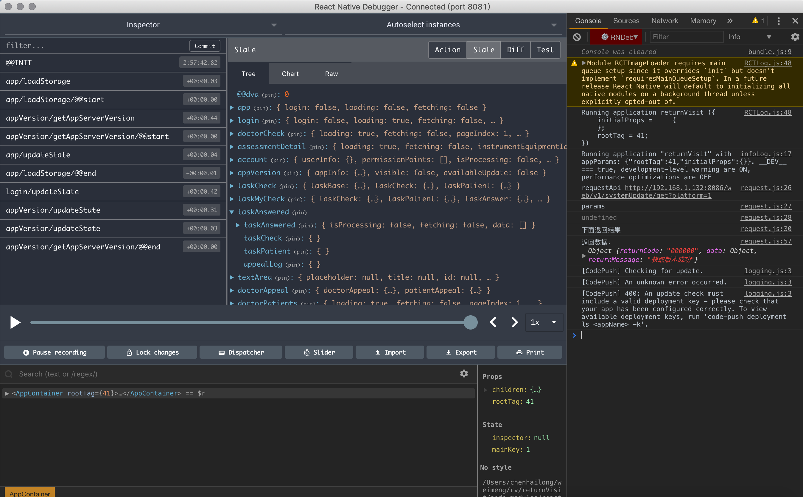
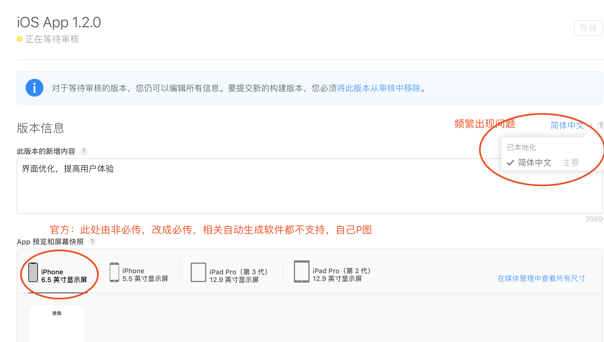
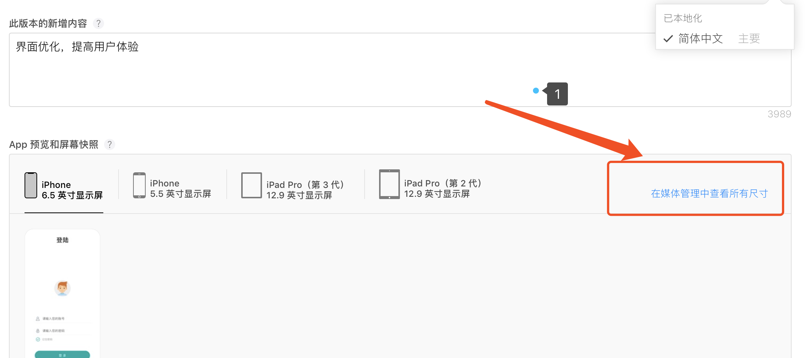
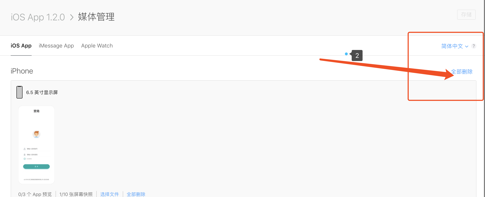

# react-native
## 脚手架
(react-native-dva)[https://github.com/nihgwu/react-native-dva-starter]
```json
{
  "name": "DvaStarter",
  "version": "0.0.1",
  "private": true,
  "scripts": {
    "start": "node node_modules/react-native/local-cli/cli.js start",
    "test": "jest"
  },
  "dependencies": {
    "dva-core": "^1.3.0",
    "react": "16.6.3",
    "react-native": "0.57.8",
    "react-navigation": "^2.5.1",
    "react-navigation-redux-helpers": "^2.0.2",
    "react-redux": "^5.0.7"
  },
  "devDependencies": {
    "@babel/plugin-proposal-decorators": "^7.3.0",
    "babel-eslint": "^8.2.4",
    "babel-jest": "^23.0.1",
    "babel-plugin-transform-decorators-legacy": "^1.3.5",
    "babel-plugin-transform-remove-console": "^6.9.4",
    "babel-preset-react-native": "^5.0.0",
    "eslint": "^5.0.0",
    "eslint-config-airbnb": "^17.0.0",
    "eslint-config-prettier": "^2.9.0",
    "eslint-plugin-babel": "^5.1.0",
    "eslint-plugin-import": "^2.12.0",
    "eslint-plugin-jsx-a11y": "^6.0.3",
    "eslint-plugin-prettier": "^2.6.1",
    "eslint-plugin-react": "^7.9.1",
    "husky": "^0.14.3",
    "jest": "^23.1.0",
    "prettier": "^1.13.5",
    "react-test-renderer": "^16.4.1"
  },
  "jest": {
    "preset": "react-native"
  }
}


```

## 组件库
[Design Mobile RN](https://rn.mobile.ant.design/index-cn)

## 调试工具
[React Native Debugger](https://github.com/jhen0409/react-native-debugger/releases)



## 上拉加载
[上拉加载更多](https://www.jianshu.com/p/4e7185fc9740)

## 发布，上架app store 改动
 * 审核时间变短了
 * 6.5寸图至少一个

 * 必须有隐私政策
 * 必须对应版本本地化（这个非常坑）
 
 
