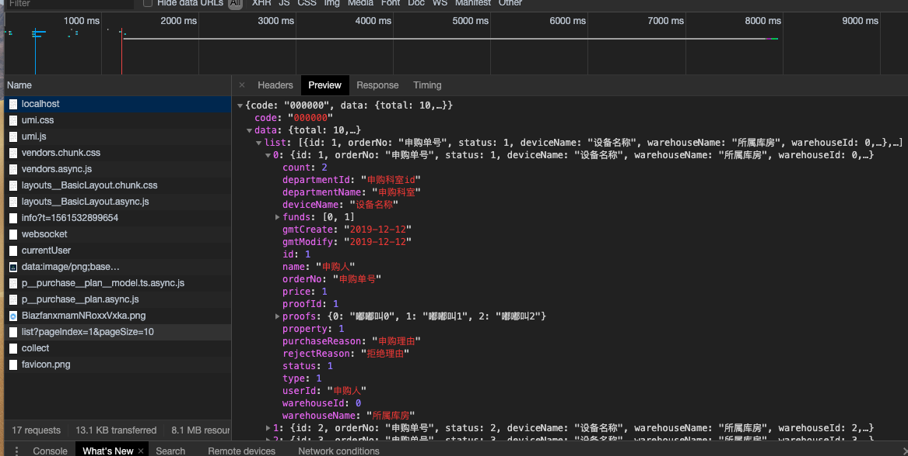

## 文档
(文档)[http://mockjs.com/examples.html#Date]
## code
```ts
import Mock from 'mockjs' // 🈯️ 

export default {
  // 支持值为 Object 和 Array
  'GET /api/purchase/plan/list': {
    'code': '000000',
    'data': {
      'total': 10,
      'list': [
        {
          id: 1,
          orderNo: '申购单号',
          status: 1,
          deviceName: '设备名称',
          warehouseName: '所属库房',
          warehouseId: 0,
          price: 1,
          count: 2,
          departmentId: '申购科室id',
          departmentName: '申购科室',
          name: '申购人',
          userId: '申购人',
          type: 1,
          property: 1,
          funds: [0, 1],
          purchaseReason: '申购理由',
          rejectReason: '拒绝理由',
          gmtModify: Mock.mock('@date("yyyy-MM-dd")'),// 🈯️ 
          gmtCreate: Mock.mock('@date("yyyy-MM-dd")'),// 🈯️ 
          proofId: 1,
          proofs: {
            0: '嘟嘟叫0',
            1: '嘟嘟叫1',
            2: '嘟嘟叫2',
          },
        },
        {
          id: 2,
          orderNo: '申购单号',
          status: 2,
          deviceName: '设备名称',
          warehouseName: '所属库房',
          warehouseId: 2,
          price: 2,
          count: 2,
          departmentId: '申购科室id',
          departmentName: '申购科室',
          name: '申购人',
          userId: '申购人',
          type: 2,
          property: 2,
          funds: [0, 1],
          purchaseReason: '申购理由',
          rejectReason: '拒绝理由',
          gmtModify: '2019-12-12',
          gmtCreate: '2019-12-12',
          proofId: 2,
          proofs: {
            0: '嘟嘟叫0',
            1: '嘟嘟叫1',
            2: '嘟嘟叫2',
          },
        },
        {
          id: 3,
          orderNo: '申购单号',
          status: 3,
          deviceName: '设备名称',
          warehouseName: '所属库房',
          warehouseId: 3,
          price: 3,
          count: 3,
          departmentId: '申购科室id',
          departmentName: '申购科室',
          name: '申购人',
          userId: '申购人',
          type: 3,
          property: 3,
          funds: [0, 1],
          purchaseReason: '申购理由',
          rejectReason: '拒绝理由',
          gmtModify: '2019-12-12',
          gmtCreate: '2019-12-12',
          proofId: 3,
          proofs: {
            0: '嘟嘟叫0',
            1: '嘟嘟叫1',
            2: '嘟嘟叫2',
          },
        },
      ],
    },
  },
  'GET /api/purchase/plan/getDetail': {
    'code': '000000',
    'data': {
      id: 0,
      orderNo: '申购单号',
      status: 0,
      deviceName: '设备名称',
      warehouseName: '所属库房',
      warehouseId: 0,
      price: '单价',
      count: '数量',
      totalPrice: '总价',
      departmentId: '申购科室id',
      departmentName: '申购科室',
      name: '申购人',
      userId: '申购人',
      type: 0,
      property: 0,
      funds: [0, 1],
      purchaseReason: '申购理由',
      rejectReason: '拒绝理由',
      gmtModify: '2019-12-12',
      gmtCreate: '2019-12-12',
      proofId: 0,
    },
  },
  'POST /api/purchase/plan/save': (req: any, res: { send: (arg0: { 'code': string; data: boolean; }) => void; }) => {
    res.send({
      code: '000000',
      data: true,
    });
  },
  'POST /api/purchase/plan/delete': (req: any, res: { send: (arg0: { 'code': string; data: boolean; }) => void; }) => {
    res.send({
      code: '000000',
      data: true,
    });
  },
  'POST /api/purchase/plan/approve': {
      code: '000000',
      data: true,
  },
  'GET /api/purchase/plan/detail': {
    code: '000000',
    data: [
      {
        id: 0,
        deviceName: '设备名称',
        warehouseName: '所属库房',
        warehouseId: 0,
        price: '单价',
        count: '数量',
        departmentId: '申购科室id',
        departmentName: '申购科室',
        name: '申购人',
        userId: '申购人',
        type: 0,
        property: 0,
        funds: [0, 1],
        purchaseReason: '申购理由',
        proofId: 0,
      },
      {
        id: 1,
        deviceName: '设备名称',
        warehouseName: '所属库房',
        warehouseId: 0,
        price: '单价',
        count: '数量',
        departmentId: '申购科室id',
        departmentName: '申购科室',
        name: '申购人',
        userId: '申购人',
        type: 0,
        property: 0,
        funds: [0, 1],
        purchaseReason: '申购理由',
        proofId: 0,
      }, {
        id: 2,
        deviceName: '设备名称',
        warehouseName: '所属库房',
        warehouseId: 0,
        price: '单价',
        count: '数量',
        departmentId: '申购科室id',
        departmentName: '申购科室',
        name: '申购人',
        userId: '申购人',
        type: 0,
        property: 0,
        funds: [0, 1],
        purchaseReason: '申购理由',
        proofId: 0,
      }, {
        id: 3,
        deviceName: '设备名称',
        warehouseName: '所属库房',
        warehouseId: 0,
        price: '单价',
        count: '数量',
        departmentId: '申购科室id',
        departmentName: '申购科室',
        name: '申购人',
        userId: '申购人',
        type: 0,
        property: 0,
        funds: [0, 1],
        purchaseReason: '申购理由',
        proofId: 0,
      },
      {
        id: 4,
        deviceName: '设备名称',
        warehouseName: '所属库房',
        warehouseId: 0,
        price: '单价',
        count: '数量',
        departmentId: '申购科室id',
        departmentName: '申购科室',
        name: '申购人',
        userId: '申购人',
        type: 0,
        property: 0,
        funds: [0, 1],
        purchaseReason: '申购理由',
        proofId: 0,
      },
    ],
  },
};


```
## 项目中请求


## easy-mock
可以作为(假)线上使用

[项目接口](https://www.easy-mock.com/project/5d131430724519274de77822)
