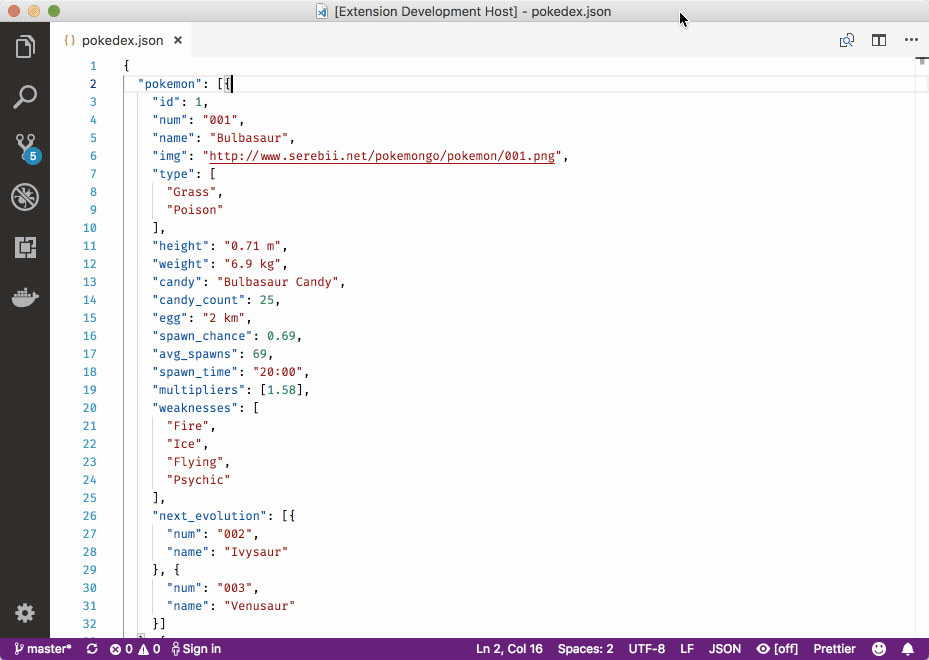

# vscode 插件 Paste JSON as Code 
（*可以将JSON快速生成type*）
## 场景
(*前端用typescript 后端用java 数据类型避免重复敲写*)
[Paste JSON as Code](https://marketplace.visualstudio.com/items?itemName=quicktype.quicktype)




## json 数据格式

(*前后端约定的接口，正常情况下，如果实行不下去，那就呵呵哒*)

```json
{
	"patientId": 1,
	"patientName": "居民",
	"phoneType": 1,
	"know": 1,
	"recentRVTime": "2019-12-12",
	"checker": "回访者",
	"mobile": "1565171000000",
	"peopleClassification": ["感冒", "伤", "腰酸背", "腿抽筋"],
	"recentTreatTime": "2019-12-12",
	"doctorTreatCount": 6,
	"unitTreatCount": 5,
	"exams": [{
			"projectId": 0,
			"projectName": "心电图0",
			"recentExamTime": "2019-04-12",
			"examTime": "2019-06-12",
			"overDays": 30
		},
		{
			"projectId": 1,
			"projectName": "心电图1",
			"recentExamTime": "2019-04-12",
			"examTime": "2019-06-12",
			"overDays": 30
		}
	]
}

```

## typescript @type
```typescript
// Generated by https://quicktype.io

export interface TopLevel {
    patientId:            number;
    patientName:          string;
    phoneType:            number;
    know:                 number;
    recentRVTime:         string;
    checker:              string;
    mobile:               string;
    peopleClassification: string[];
    recentTreatTime:      string;
    doctorTreatCount:     number;
    unitTreatCount:       number;
    exams:                Exam[];
}

export interface Exam {
    projectId:      number;
    projectName:    string;
    recentExamTime: string;
    examTime:       string;
    overDays:       number;
}


```

## java view实体类
```java
// TopLevel.java

// Generated by https://quicktype.io

// package io.quicktype;

import java.util.Map;

public class TopLevel {
    private long patientID;
    private String patientName;
    private long phoneType;
    private long know;
    private String recentRVTime;
    private String checker;
    private String mobile;
    private String[] peopleClassification;
    private String recentTreatTime;
    private long doctorTreatCount;
    private long unitTreatCount;
    private Exam[] exams;

    public long getPatientID() { return patientID; }
    public void setPatientID(long value) { this.patientID = value; }

    public String getPatientName() { return patientName; }
    public void setPatientName(String value) { this.patientName = value; }

    public long getPhoneType() { return phoneType; }
    public void setPhoneType(long value) { this.phoneType = value; }

    public long getKnow() { return know; }
    public void setKnow(long value) { this.know = value; }

    public String getRecentRVTime() { return recentRVTime; }
    public void setRecentRVTime(String value) { this.recentRVTime = value; }

    public String getChecker() { return checker; }
    public void setChecker(String value) { this.checker = value; }

    public String getMobile() { return mobile; }
    public void setMobile(String value) { this.mobile = value; }

    public String[] getPeopleClassification() { return peopleClassification; }
    public void setPeopleClassification(String[] value) { this.peopleClassification = value; }

    public String getRecentTreatTime() { return recentTreatTime; }
    public void setRecentTreatTime(String value) { this.recentTreatTime = value; }

    public long getDoctorTreatCount() { return doctorTreatCount; }
    public void setDoctorTreatCount(long value) { this.doctorTreatCount = value; }

    public long getUnitTreatCount() { return unitTreatCount; }
    public void setUnitTreatCount(long value) { this.unitTreatCount = value; }

    public Exam[] getExams() { return exams; }
    public void setExams(Exam[] value) { this.exams = value; }
}

// Exam.java

// package io.quicktype;

import java.util.Map;

public class Exam {
    private long projectID;
    private String projectName;
    private String recentExamTime;
    private String examTime;
    private long overDays;

    public long getProjectID() { return projectID; }
    public void setProjectID(long value) { this.projectID = value; }

    public String getProjectName() { return projectName; }
    public void setProjectName(String value) { this.projectName = value; }

    public String getRecentExamTime() { return recentExamTime; }
    public void setRecentExamTime(String value) { this.recentExamTime = value; }

    public String getExamTime() { return examTime; }
    public void setExamTime(String value) { this.examTime = value; }

    public long getOverDays() { return overDays; }
    public void setOverDays(long value) { this.overDays = value; }
}


```

## 注意

* mac快捷键
  * shift + option + command + v
  * 选中需要转化的类型
* 需到另一个文件，执行命令 
  * shift + option + command + v


## 在线转换

[bejson](https://www.wanandroid.com/tools/bejson)
