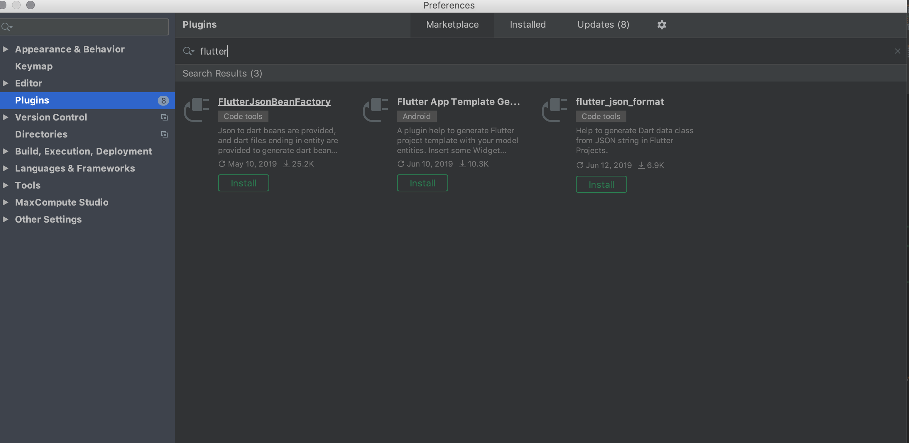

## Editing
快捷键|en|zh
:---|:--|:---
control + space|Basic code completion|基本代码完成
option+enter|Show intention actions and quick-fixes|显示提示/快速修复
⌘P|Parameter info (within method call arguments)|参数信息（在方法调用参数内）
control + J|Quick documentation lookup|快速查找文件
⌘ + mouse over code|Brief Info|简介
⌘F1 |Show descriptions of error or warning at caret|
⌘N |Generate code... |生成代码|
⌥⌘T| Surround with... (if..else, try..catch, for, etc.)
⌘J |Insert Live template| 插入模版
⌘ / |Comment/uncomment with line comment| 单行注释
⌘ ⇧ / | Comment/uncomment with block comment| 块注释
option + up|Select successively increasing code blocks |选择连续递增的代码块
option + down|Decrease current selection to previous state|选择连续递减的代码块
^ ⇧ Q | Context info | 上下文信息
option + command + L | Reformat code | 格式化代码
option+command + I | Auto-indent line(s) | 自动指数线
tab|Indent selected lines| 选定行的缩进
shift tab|Unindent selected lines| 取消选定行的缩进
command + shift + V | Paste from recent buffers... | 从缓存中粘贴
command + D | Duplicate current line or selected block | 复制当前行
command + delete | Delete line at caret| 删除当前行
option + shift + up |Move line up|移动行向上
option + shift + down | Move line down
control + shift +J |Join lines| 合并行
command + enter |Split line | 分行
shift + enter |Start new line|另起一行
command + shift + U | Toggle case for word at caret or selected block | 大小写切换
option + command + shift +] | Select till code block end |选中代码至文档结束
option + shift +command + [ | Select till code block start |选中代码至文档开始
option + 反删除|Delete to word end | 删除至单词结尾
option + delete | Delete to word start | 删除至单词开始
command+ / - |  Expand/collapse code block | 展开/折叠代码块
shift + command + "+" | Expand all | 展开全部
shift + command + "-" |Collapse all | 折叠全部
command + W | Close active editor tab| 关闭活跃的标签

## Multiple carets and selections 多个插入符号和选定内容

快捷键|en|zh|
:---|:---|:---
option + Click |Add or remove caret|插入多个光标
control + command + G |Select all occurrences|  选择所有事件
control + G |Select next occurrence|向下选中出现
control + shift +G |Unselect occurrence|取消出现选中
|Unselect all occurrences or caret|

### Navigation 跳转
快捷键|en|zh|
:---|:---|:---
command + B , command+Click | Go to declaration | 跳转声明地方
command+ O | Go to class | 跳转对应的类
shift + command + O | Go to file | 跳转文件
option + command + O | Go to symbol | 跳转symbol记号
shift + command + ] | Go to next editor tab | 跳转下一个编辑标签页
shift + command + [ | Go to previous editor tab | 跳转上一个编辑标签页
F12 | Go back to previous tool window | 回到上一个工具窗口
没找到这个键 | Go to editor (from tool window)|
command + L | Go to line | 跳转行
command + E | Recent files popup | 最近文件弹出层
option + command + left | Navigate back | 跳转记录返回
option + command + right | Navigate forward | 跳转记录向前
command + shift + delete | Navigate to last edit location |跳转上次编辑的地方
option + F1 | Select current file or symbol in any view | 选中当前文件或者是标记
option + command + B | Go to implementation(s) | 跳转实现
option + Space , command Y | Open quick definition lookup | 打开快速定义查找
control + shift + B | Go to type declaration | 跳转类型声明
command + U | Go to super-method/super-class | 跳转父类或方法
control + up | Go to previous method | 跳转之前的方法
control + down | Go to next method | 跳转下一个方法
option + command + ] | Move to code block end | 移动代码快到尾部
option + command + [ | Move to code block start | 移动代码快到头部
control + M | Move caret to matching brace | 将插入符号移动到匹配的大括号
command  + F12 | File structure popup | 文件结构弹出
control + H | Type hierarchy |  类型层次结构
control + option + H | Call hierarchy | 调用层次结构
F2 | Next highlighted error | 下一个高亮的错误
shift + F2  | Previous highlighted error | 上一个高亮的错误
F4 , command + down | Jump to source | 跳转源码
command + up | Jump to navigation bar | 跳转到导航栏
F3 | Toggle bookmark | 显/隐书签
option + F3 | Toggle bookmark with mnemonic | 用助记键切换书签
control + 0 ... 9 | Go to numbered bookmark | 跳转书签
command + F3 | Show bookmarks|展示书签

## 版本管理
快捷键|en|zh|
:---|:---|:---
control + V | ‘VCS’ quick popup |  版本管理弹出层
command + K | Commit project to VCS | commit
command + T | Update project from VC C View recent changes | 从版本仓库更新代码
option + shift + c | View recent changes | 查看改变
## 通用
快捷键|en|zh|
:---|:---|:---
Double shift| Search everywhere| 全局搜索
shift + command + A |  Find Action| 查找并调用编辑器的功能
command + 0 ... 9 | Open corresponding tool window | 快速切换打开界面模块
shift + command + F12 | Toggle maximizing editor | 编辑器最大化
option + shift + F | Add to Favorites | 添加到喜欢
option + shift + I | Inspect current file with current profile | 使用当前属性检查当前文件(没啥效果)
control + `  | Quick switch current scheme | 快速转换现有组合(没啥效果)
 command + , 、 Open Preferences | 设置
control + tab | Switch between tabs and tool window | 在标签页和工具间切换
## Search/Replace 查找替换
快捷键|en|zh|
:---|:---|:---
 command + F / command + R | Find / Replace | 查找/替换
 command+ G / shift + command + G | Find next/previous | 找前/后一个
 shift + command + F | Find in path | 查找路径
 shift + command + R | Replace in path | 替换路径

## 插件
Rainbow Brackets

## flutter 插件

  

[FlutterJsonBeanFactory插件json使用](https://www.jianshu.com/p/14cbcbaa74b7?tdsourcetag=s_pcqq_aiomsg)

[CamelCase](https://plugins.jetbrains.com/plugin/7160-camelcase)
缺陷:仅能实现大驼峰、小驼峰、下划线、中划线转化,并不能按照单词进行变换

  

